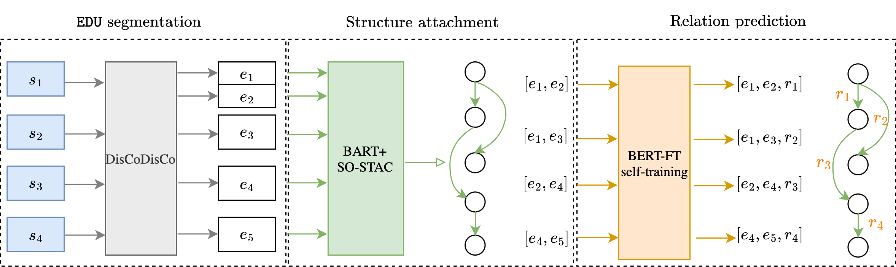

# DisRel-w-selftraining
This is a source code repository for discourse relation prediction using self training and the first semi-supervised discourse parsing pipeline (CODI 2024).

Pipeline:


Code:

Repo `src_selftrain`
  - `finetune.py`: finetune BERT code
  - `self-train`: self training code, need finetuned BERT checkpoints as input.

Data:
- `data_reanno_molweni/molweni_clean_test50.json`: re-annotated 50 documents in Molweni test set
- `data_reanno_molweni/molweni_original_test50.json`: original annotation in Molweni

Please consider citing our paper: 
```
@inproceedings{li-etal-2024-discourse,
    title = "Discourse Relation Prediction and Discourse Parsing in Dialogues with Minimal Supervision",
    author = "Li, Chuyuan  and
      Braud, Chlo{\'e}  and
      Amblard, Maxime  and
      Carenini, Giuseppe",
    editor = "Strube, Michael  and
      Braud, Chloe  and
      Hardmeier, Christian  and
      Li, Junyi Jessy  and
      Loaiciga, Sharid  and
      Zeldes, Amir  and
      Li, Chuyuan",
    booktitle = "Proceedings of the 5th Workshop on Computational Approaches to Discourse (CODI 2024)",
    month = mar,
    year = "2024",
    address = "St. Julians, Malta",
    publisher = "Association for Computational Linguistics",
    url = "https://aclanthology.org/2024.codi-1.15",
    pages = "161--176",
```